<h3><code>farrukh@github ~ $ whoami</code></h3>

<table>
<tr>
<td valign="top"></td>
<td valign="top"></td>
</tr>
</table>

 

<h3><code>farrukh@arch ~ $ fastfetch</code></h3>

 

 

<h3><code>farrukh@github ~ $ ./skills.sh</code></h3>

  

 

<h3><code>farrukh@github ~ $ ./contributions.sh</code></h3>

 
 

<h3><code>farrukh@github ~ $ ./activity.sh</code></h3>

<picture>
  <source media="(prefers-color-scheme: dark)" srcset="https://raw.githubusercontent.com/FarrukhDev-io/FarrukhDev-io/output/github-contribution-grid-snake-dark.svg">
  <source media="(prefers-color-scheme: light)" srcset="https://raw.githubusercontent.com/FarrukhDev-io/FarrukhDev-io/output/github-contribution-grid-snake.svg">
  
</picture>

 
 

<h3><code>farrukh@github ~ $ ./links.sh</code></h3>

   
  <code>Role&nbsp;&nbsp;&nbsp;&nbsp;&nbsp;&nbsp;:</code> Frontend Software Engineer 🚀  
  <code>Focus&nbsp;&nbsp;&nbsp;&nbsp;&nbsp;:</code> Crafting scalable web applications, modern UI/UX, and high-performance tools  
  <code>Portfolio&nbsp;:</code> <a href="https://www.farrukh-dev.me">https://www.farrukh-dev.me</a>  
  <code>LinkedIn&nbsp;&nbsp;:</code> <a href="https://linkedin.com/in/farrukh-jumayev">linkedin.com/in/farrukh-jumayev</a>  
  <code>Twitter&nbsp;&nbsp;&nbsp;:</code> <a href="https://twitter.com/FarrukhDjumayev">@FarrukhDjumayev</a>  
  <code>Email&nbsp;&nbsp;&nbsp;&nbsp;&nbsp;:</code> <a href="mailto:contact@farrukh-dev.me">contact@farrukh-dev.me</a>

 

